# Gráficos en R

R es un lenguaje de programación y entorno computacional dedicado a la estadística que dispone de múltiples funciones diseñadas para la representación gráfica de datos.

Revisa la presentación completa [aquí](https://drive.google.com/u/0/uc?id=1t_zGzI25aQp3j3ffs1RnIcyUzgee7azf&export=download)


## Tipos de gráficos en R

Existe una gran variedad de gráficos que pueden utilizarse según el tipo de datos que se tengan.


[Fuente](https://www.r-graph-gallery.com/)

## Paqueterías para graficar en R

Existen diversas paqueterías en R que facilitan la creación de gráficos. Cada paquetería permite crear diversos tipos de gráficos.

+ **[graphics](https://www.rdocumentation.org/packages/graphics/versions/3.6.2)**
+ [grid](https://cran.r-project.org/package=grid) 
+ [Lattice](https://cran.r-project.org/web/packages/lattice/lattice.pdf)
+ **[ggplot2](https://cran.r-project.org/package=ggplot2)**
+ [gganimate](https://cran.r-project.org/package=gganimate)
+ [Highcharts](https://cran.r-project.org/package=highcharter)
+ [bbplot](https://github.com/bbc/bbplot)
+ [ggfortify](https://cran.r-project.org/package=ggfortify)


## Gráficos de base R

R cuenta con el paquete base de graphics para la construcción de gráficos. La función `plot` es la función básica que permite crear:

+ Líneas 
+ Barras
+ Boxplots
+ Matrices de dispersión

## Paletas de colores en R 

Los colores son uno de los elementos esenciales de un gráfico. Forman parte de la estética y por tanto, los podemos utilizar tanto para representar variables, como para destacar elementos dentro de la visualización.

[Aquí](http://www.stat.columbia.edu/~tzheng/files/Rcolor.pdf) y [aquí](https://htmlcolorcodes.com/) puedes revisar los colores disponibles en R que puedes usar en tus gráficas.

## ggplot2

[ggplot2](https://cran.r-project.org/package=ggplot2) es una de las paqueterías más populares en R para crear una gran variedad de gráficos. `ggplot2` es un sistema para la creación declarativa de gráficos basado en la gramática de gráficos. En esta gramática, se separan los elementos o las partes de un gráfico en diferentes capas o layers, y así es más fácil modificarlos.

`ggplot2` funciona a través de la grámatica de gráficos donde se dan los datos, las variables que queremos a graficar y la geometría deseada.

Instalación de ggplot2

```r
install.packages("tidyverse")
install.packages("ggplot2")
```

Cargar la librería de trabajo

```r
library(ggplot2)
```

Importamos el set de datos que puedes descargar de [aquí](https://drive.google.com/u/0/uc?id=1KXYsccyizof0M1qd1WoA0cWJVaqZq_H2&export=download)


```r
datos <- read.csv("BRCA_1.csv")
```


```r
head(datos)
```

```
##     Patient_ID Age Gender  Protein1 Protein2  Protein3  Protein4   Protein5
## 1 TCGA-D8-A1XD  36 FEMALE  0.080353  0.42638  0.547150  0.273680 -0.8377779
## 2 TCGA-EW-A1OX  43 FEMALE -0.420320  0.57807  0.614470 -0.031505  3.9312819
## 3 TCGA-A8-A079  69 FEMALE  0.213980  1.31140 -0.327470 -0.234260 12.0651683
## 4 TCGA-D8-A1XR  56 FEMALE  0.345090 -0.21147 -0.193040  0.124270  1.3747799
## 5 TCGA-BH-A0BF  56 FEMALE  0.221550  1.90680  0.520450 -0.311990  3.5984373
## 6 TCGA-AO-A1KQ  84   MALE -0.081872  1.72410 -0.057335  0.043025 10.4367737
##   Protein6   Protein7  Protein8 Tumour_Stage                     Histology
## 1 1.121232  1.2252707  1.693330          III Infiltrating Ductal Carcinoma
## 2 4.004814  3.7966065  3.818823           II            Mucinous Carcinoma
## 3 8.089310  7.0638903  7.970331          III Infiltrating Ductal Carcinoma
## 4 2.158426 10.8775737 10.461724           II Infiltrating Ductal Carcinoma
## 5 2.138539  0.5366344  1.543580           II Infiltrating Ductal Carcinoma
## 6 9.154762  5.3596392  3.372255          III Infiltrating Ductal Carcinoma
##   ER.status PR.status HER2.status                Surgery_type Date_of_Surgery
## 1  Positive  Positive    Negative Modified Radical Mastectomy       15-Jan-17
## 2  Positive  Positive    Negative                  Lumpectomy       26-Apr-17
## 3  Positive  Positive    Negative                       Other       08-sep-17
## 4  Positive  Positive    Negative Modified Radical Mastectomy       25-Jan-17
## 5  Positive  Positive    Negative                       Other       06-may-17
## 6  Positive  Positive    Negative Modified Radical Mastectomy       18-sep-17
##   Date_of_Last_Visit Patient_Status
## 1          19-jun-17          Alive
## 2          09-nov-18           Dead
## 3          09-jun-18          Alive
## 4          12-jul-17          Alive
## 5          27-jun-19           Dead
## 6          15-nov-21          Alive
```

```r
names(datos)
```

```
##  [1] "Patient_ID"         "Age"                "Gender"            
##  [4] "Protein1"           "Protein2"           "Protein3"          
##  [7] "Protein4"           "Protein5"           "Protein6"          
## [10] "Protein7"           "Protein8"           "Tumour_Stage"      
## [13] "Histology"          "ER.status"          "PR.status"         
## [16] "HER2.status"        "Surgery_type"       "Date_of_Surgery"   
## [19] "Date_of_Last_Visit" "Patient_Status"
```
Eliminar datos con NA

```r
datos <- na.omit(datos)
```

### Scatterplots
Vamos a crear un gráfico del tipo scatterplot muy básico con ggplot2. 

```r
ggplot(datos, aes(x = Protein7, y = Protein8)) + 
  geom_point()
```

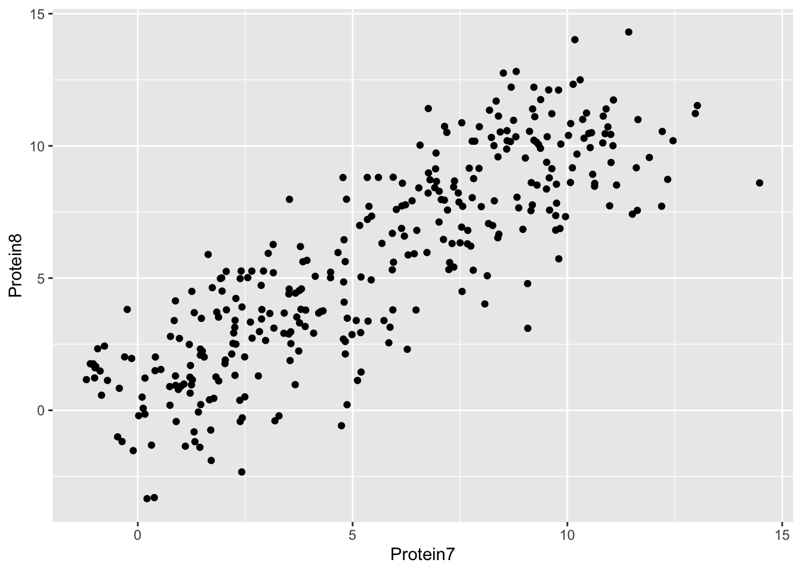

Ahora vamos a colorear todos los puntos utilizando `geom_point(color)`. 

```r
ggplot(datos, aes(x = Protein7, y = Protein8)) + 
  geom_point(color="red", size= 2)
```

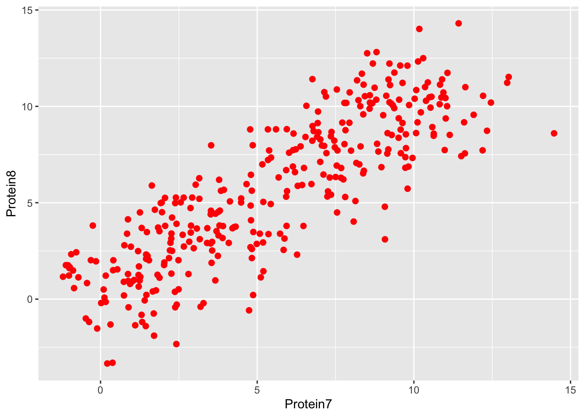

Con el argumento `color` coloreamos por estadío de tumor. 

```r
ggplot(datos, aes(x = Protein7, y = Protein8, color= Tumour_Stage)) + 
  geom_point()+ 
  labs(x = "Proteina 7" ,y = "Proteina 8", subtitle = "Scatterplot")+
  ggtitle("Cáncer de mama")
```

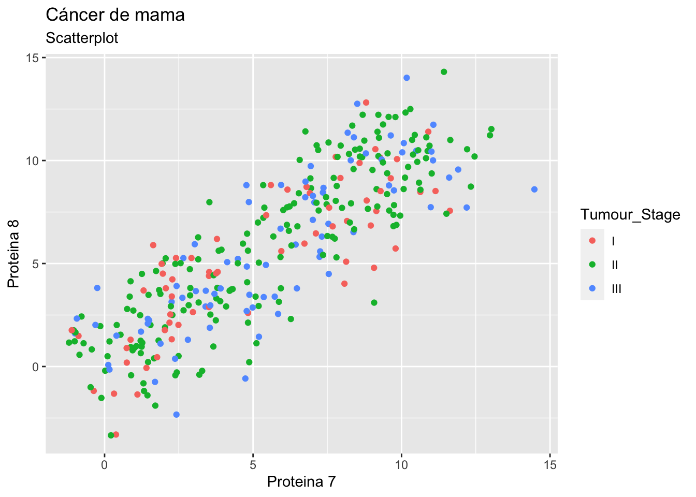


Para agregar las etiquetas de los ejes usamos `labs()`, mientras que `ggtitle()`permite agregar el título al gráfico como se muestra a continuación.

```r
ggplot(datos, aes(x = Protein7, y = Protein8, color= Tumour_Stage)) + 
  geom_point()+
  labs(x = "Proteina 7" ,y = "Proteina 8", subtitle = "Scatterplot")+
  ggtitle("Cáncer de mama")
```


`shape` permite modificar la forma del punto. En este caso vamos a poner diferentes puntos según la especie de flor.

```r
ggplot(datos, aes(x = Protein7, y = Protein8, color=Tumour_Stage, shape=Tumour_Stage)) + 
  geom_point(size=3) +
  theme_bw()+
  labs(x = "Proteina 7" ,y = "Proteina 8", subtitle = "Scatterplot")+
  ggtitle("Cáncer de mama")
```

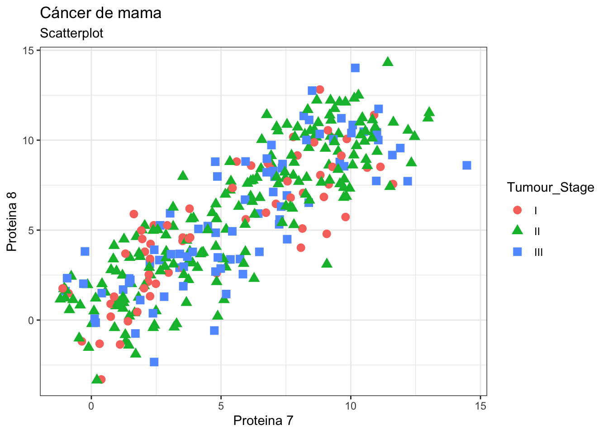


Cambiamos la posición de la leyenda en nuestro gráfico

```r
ggplot(datos, aes(x = Protein7, y = Protein8, color= Tumour_Stage)) + 
  geom_point()+ 
  labs(x = "Proteina 7" ,y = "Proteina 8", subtitle = "Scatterplot")+
  ggtitle("Cáncer de mama")+
  theme_bw()+
  theme(legend.position = "bottom")
```

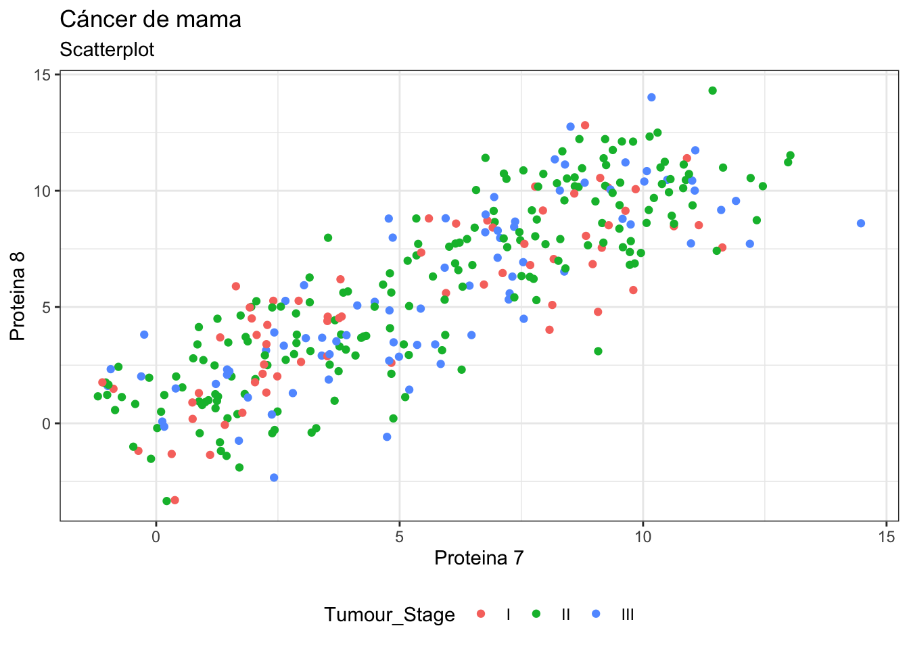

Otra opción para modificar los colores es utilizando `scale_colour_manual()`. Con este argumento indicamos los colores que queremos usar para nuestro gráfico basados en la paleta de colores. 

```r
ggplot(datos, aes(x = Protein7, y = Protein8, color= Tumour_Stage)) + 
  geom_point()+ 
  labs(x = "Proteina 7" ,y = "Proteina 8", subtitle = "Scatterplot")+
  ggtitle("Cáncer de mama")+
  theme_bw()+
  theme(legend.position = "bottom")+
  scale_colour_manual(values=c("navy", "mediumvioletred", "mediumturquoise"))
```

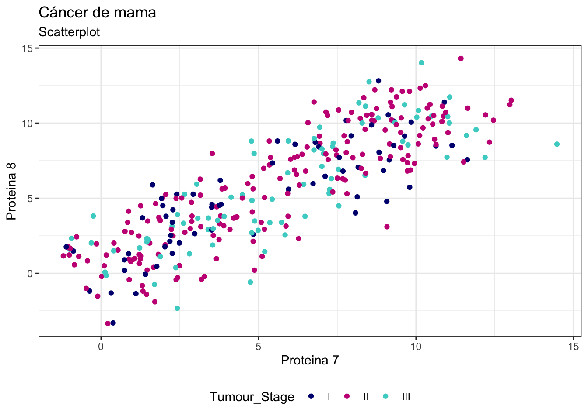


### RcolorBrewer

RcolorBrewer es una paquetería exclusiva de colores que podemos usar en nuestros gráficos.

```r
install.packages("RColorBrewer")
```

```r
library(RColorBrewer)
```

Conocer todas las paletas de colores disponibles en RColorBrewer.

```r
display.brewer.all()
```

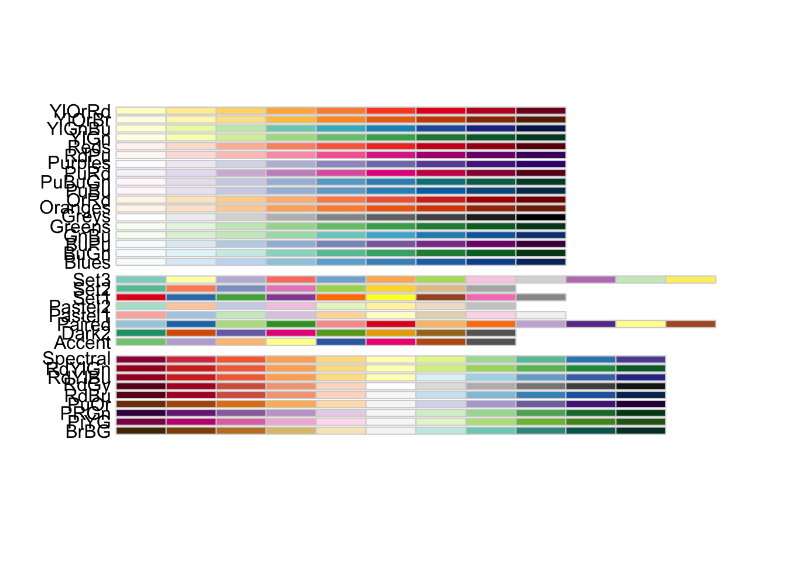

Vamos a elegir la paleta "Dark2" para personalizar nuestro gráfico. Usamos el argumento `scale_colour_brewer()` como se muestra a continuación


```r
ggplot(datos, aes(x = Protein7, y = Protein8, color= Tumour_Stage)) + 
  geom_point()+ 
  labs(x = "Proteina 7" ,y = "Proteina 8", subtitle = "Scatterplot")+
  ggtitle("Cáncer de mama")+
  theme_bw()+
  theme(legend.position = "bottom")+
  scale_colour_brewer(palette="Dark2")
```

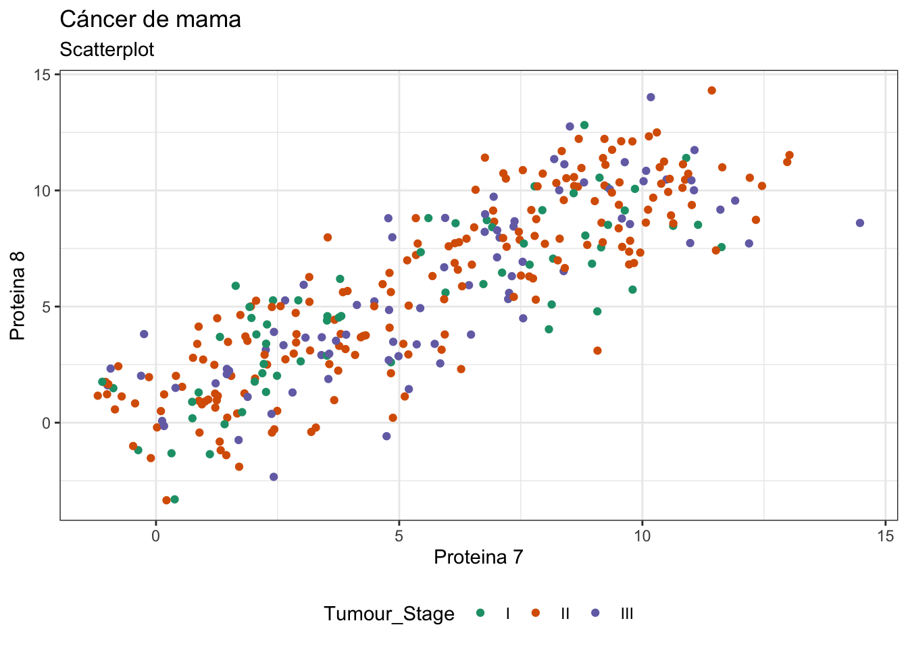

### Múltiples gráficos en una sola imagen

```r
ggplot(datos, aes(x = Protein7, y = Protein8, color= Tumour_Stage)) + 
  geom_point() +
  facet_wrap(~Tumour_Stage)+ 
  labs(x = "Proteina 7" ,y = "Proteina 8", subtitle = "Scatterplot")+
  ggtitle("Cáncer de mama")+
  theme_bw()+
  theme(legend.position = "bottom")+
  scale_colour_manual(values=c("navy", "mediumvioletred", "mediumturquoise")) +
  theme(axis.text.x = element_text(angle = 90, vjust = 0.5, hjust=1))
```

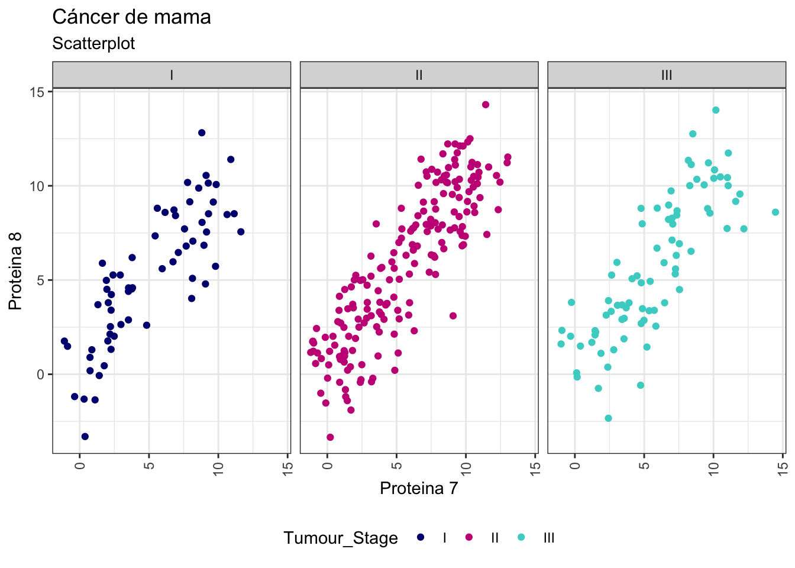

### Histogramas

```r
ggplot(datos, aes(x=Age))+
  geom_histogram(bins=30, color="darkblue", fill="lightblue")+
  theme_bw()
```

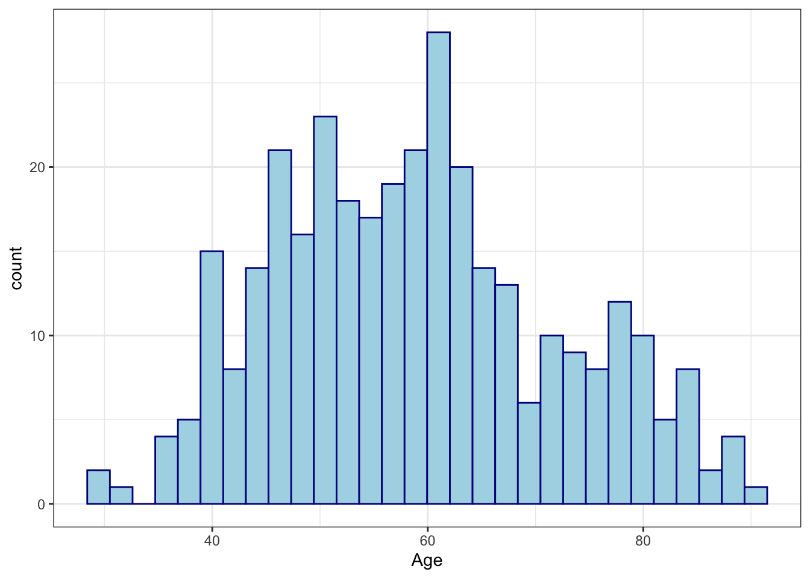

Colorear histogramas por género

```r
ggplot(datos, aes(x=Age, color= Gender))+
  geom_histogram(bins=30, fill= "White")+
  theme_gray()+
  labs(x = "Edad" ,y = "Frecuencia", subtitle = "Histograma")+
  ggtitle("Cáncer de mama")
```

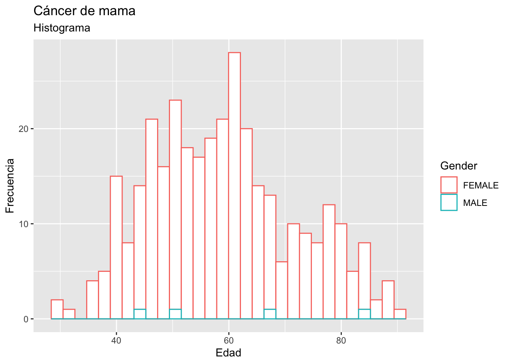


```r
p<- ggplot(datos, aes(x=Age, fill= Gender))+
  geom_histogram(bins=30, color= "Black", alpha=0.6)+
  theme_gray()+
  labs(x = "Edad" ,y = "Frecuencia", subtitle = "Histograma")+
  ggtitle("Cáncer de mama")

p + scale_fill_brewer(palette="Accent") + 
  theme_gray()+
  theme(legend.position="top")
```

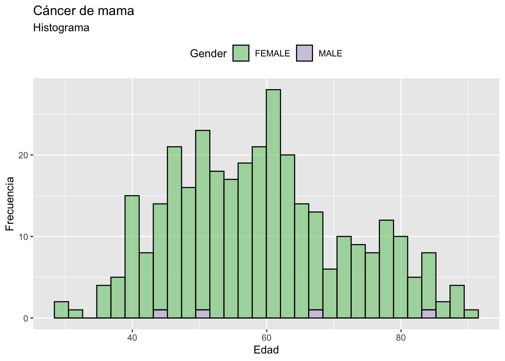

### Boxplots

```r
names(datos)
```

```
##  [1] "Patient_ID"         "Age"                "Gender"            
##  [4] "Protein1"           "Protein2"           "Protein3"          
##  [7] "Protein4"           "Protein5"           "Protein6"          
## [10] "Protein7"           "Protein8"           "Tumour_Stage"      
## [13] "Histology"          "ER.status"          "PR.status"         
## [16] "HER2.status"        "Surgery_type"       "Date_of_Surgery"   
## [19] "Date_of_Last_Visit" "Patient_Status"
```

Creamos un boxplot básico

```r
ggplot(datos, aes(y = Protein7, x= Tumour_Stage)) + 
  geom_boxplot()
```

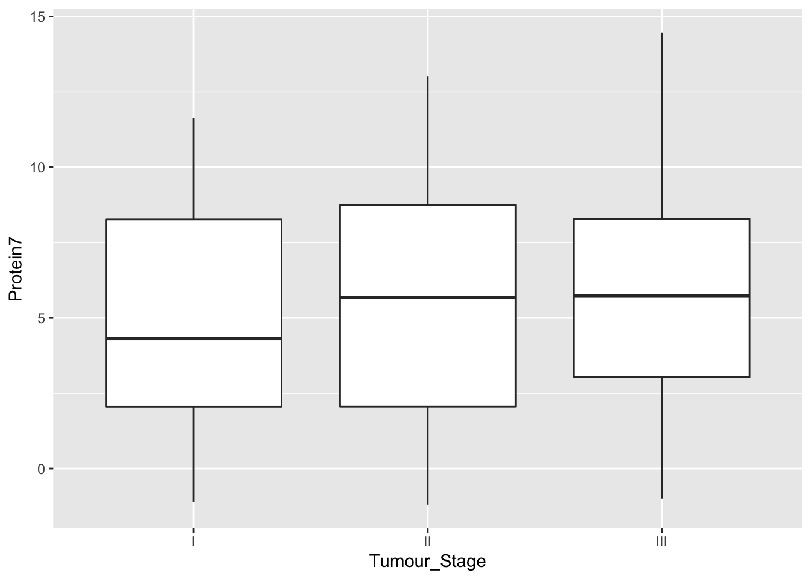

Personalizamos el boxplot

```r
ggplot(datos, aes(y = Protein7, x= Tumour_Stage, fill=Tumour_Stage)) + 
  geom_boxplot()+
  ggtitle("Cancer de mama")+
  theme_light()+
  labs(subtitle = "Boxplot", y= "Proteína 7", x="Estadío del tumor")
```

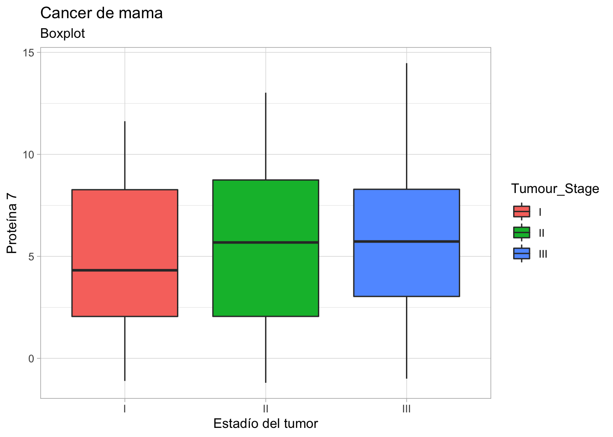

Colorear manualmente los boxplots 

```r
ggplot(datos, aes(y = Protein7, x= Tumour_Stage, fill=Tumour_Stage)) + 
  geom_boxplot()+
  ggtitle("Cáncer de mama")+
  theme_light()+
  labs(subtitle = "Boxplot", y= "Proteína 1", x="Estadío del tumor")+
  scale_fill_manual(values=c("navy", "mediumvioletred", "mediumturquoise"))
```

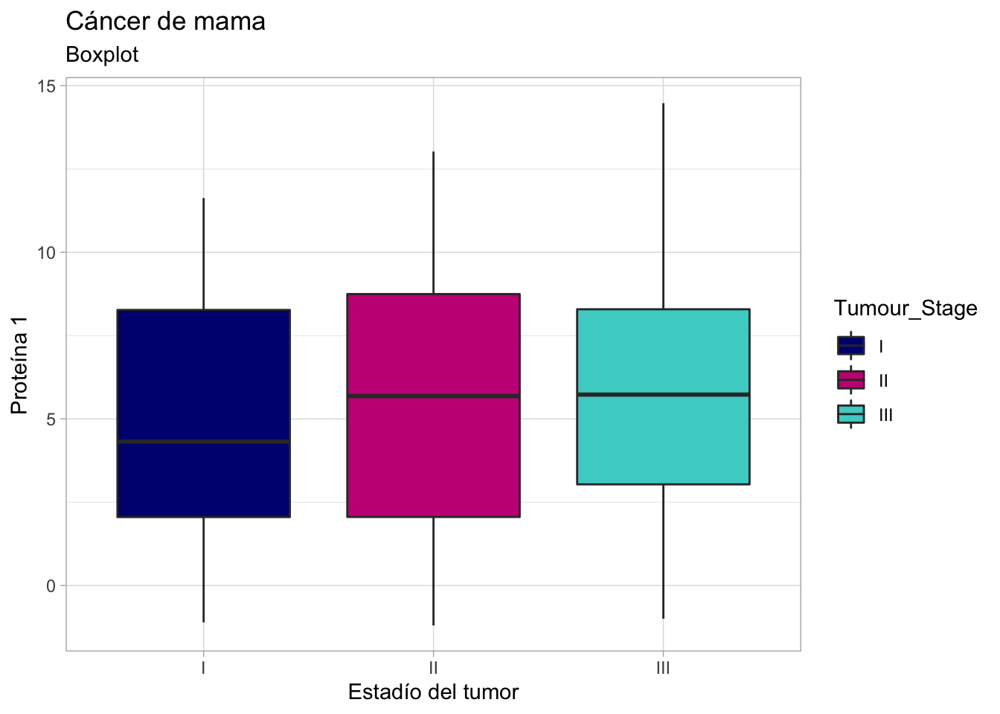

Colorear utilizando paletas de colores


```r
ggplot(datos, aes(y = Protein1, x= Tumour_Stage, fill=Tumour_Stage)) + 
  geom_boxplot()+
  ggtitle("Cáncer de mama")+
  labs(subtitle = "Boxplot", y= "Proteína 1", x="Estadío del tumor")+
  theme_bw()+
  theme(legend.position = "bottom")+
  scale_fill_brewer(palette="Dark2")
```

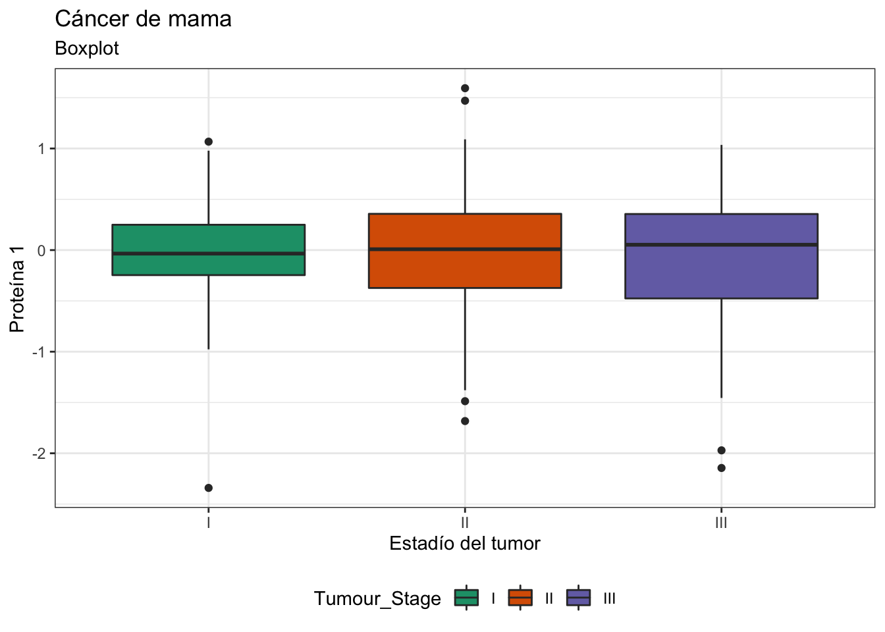


Boxplots agrupados por mutaciones de HER2 y estadío de tumor

```r
ggplot(datos, aes(y = Protein7, x= Tumour_Stage, fill=HER2.status)) + 
  geom_boxplot()+ 
  scale_fill_brewer(palette="Set2")+
  theme_bw()+
  theme(legend.position = "bottom")+
  ggtitle("Cáncer de mama")+
  labs(subtitle = "Boxplot", y= "Proteína 17", x="Estadío del tumor")
```

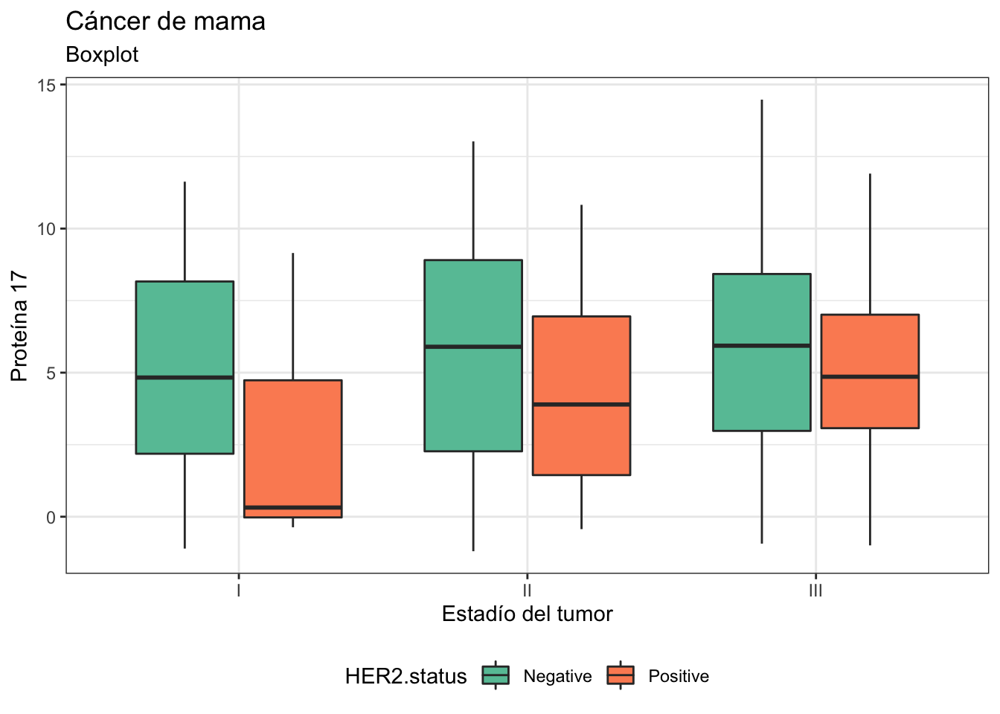


Multiples boxplots separados por mutaciones de HER2 y estadío de tumor

```r
ggplot(datos, aes(y = Protein7, x= Tumour_Stage, fill=HER2.status)) + 
  geom_boxplot() +
  facet_wrap(~HER2.status)+
  scale_fill_brewer(palette = "PiYG")+
  theme_bw()+
  theme(legend.position = "bottom")+
  ggtitle("Cáncer de mama")+
  labs(subtitle = "Boxplot", y= "Proteína 7", x="Estadío del tumor")
```

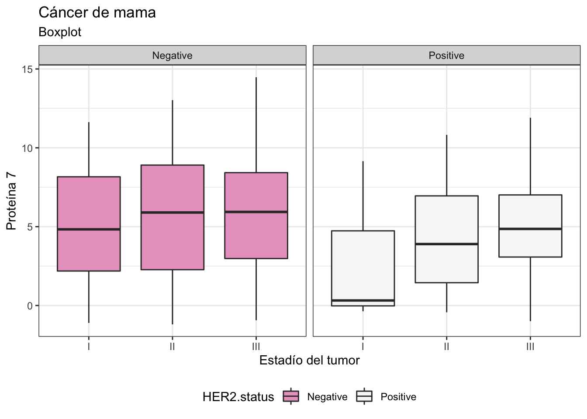

